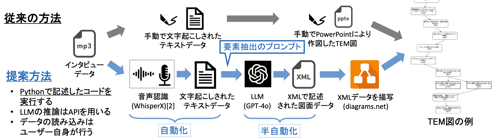

# TEM/TEA分析のためのLLM自動作図パイプライン

※ **注記**: 本プロジェクトのソースコードは、現在学術論文として投稿中のため非公開（Private）としております。本ドキュメントでは、システムの全体設計およびUXの工夫について公開しています。

## 1. プロジェクト概要
心理学研究手法「TEM（複線径路等至性モデリング）」における分析・作図作業を、LLMを活用して自動化するプログラムを開発しました。
従来、数週間〜数ヶ月を要していた作図プロセスを数分〜数時間に短縮し、研究者の負担を大幅に軽減することに成功しました。

## 2. 開発背景と解決した課題
心理学研究分野ではIT活用が遅れており、特に「TEM」というアプローチでは、インタビュー結果の分析（逐語録作成と作図）に膨大な人的・時間的コストがかかる点が課題でした。
そこで、ボトルネックとなっていたこのプロセスに着目し、自動化システムの開発を行いました。

## 3. システムアーキテクチャ
自動文字起こしによる誤字等を含むテキストを前処理なしで解析するため、OpenAI APIの自然言語理解能力を応用しました。
また、複雑な図をLLMに直接描画させることは困難であったため、図面をテキスト形式で出力するアーキテクチャを考案・実装しました。

1. **情報抽出**: インタビューの文字起こしテキストを入力とし、GPT-4oが心理学の理論に基づきキーワードや関係性を抽出・分類。
2. **図面データ生成**: 抽出した情報をもとに、作図ツール「diagrams.net」で解釈可能な中間形式のテキスト（図面データ）を出力。

## 4. 使用技術
* **言語**: Python
* **外部API**: OpenAI API (GPT-4o)
* **ライブラリ**: `tqdm`, `os`, `datetime`
* **開発環境**: Visual Studio Code
* **外部ツール**: diagrams.net (draw.io)

## 5. UX設計へのこだわり
本プログラムの目的は「研究者の負担軽減」であり、ITに不慣れな心理学研究者が「迷わず・不安なく・シームレスに」使える体験の実現にこだわりました。

* **ワンクリックでの作図体験**: 生成された図面データから作図ツールへの移行をバッチファイルで自動化。ユーザーはファイルを開くだけでブラウザが起動し、シームレスに図を編集できる環境を構築しました。
* **待ち時間の不安解消**: API処理時の数分の待ち時間に対し、実測時間に基づいた「仮想の進捗バー」を実装し、処理状況を可視化することでユーザーが安心して待てるよう工夫しました。

## 6. プロジェクトにおける役割
企画から要件定義、アーキテクチャ設計、実装、テストまでのコード開発は一貫して一人で担当しました。

同時に、プロジェクト全体では異分野の知見と実装を繋ぐ役割を担いました。
心理学の教授や先輩方と週に一度のミーティングを重ね、専門家のニーズと実装可能性のズレを特定・修正し、アジャイルな改善を回しながらプロジェクトを推進しました。

## 7. 成果
* 従来数週間〜数ヶ月を要した分析・作図プロセスを**数分〜数時間**に短縮。
* 心理学研究者の方々に試用いただき、「分析の本質的な部分により多くの時間を割けるようになった」との評価を獲得。
* 質的研究の学会（ポスター発表・シンポジウム）にて、非専門家にも伝わるよう技術内容を翻訳し研究発表を実施。
